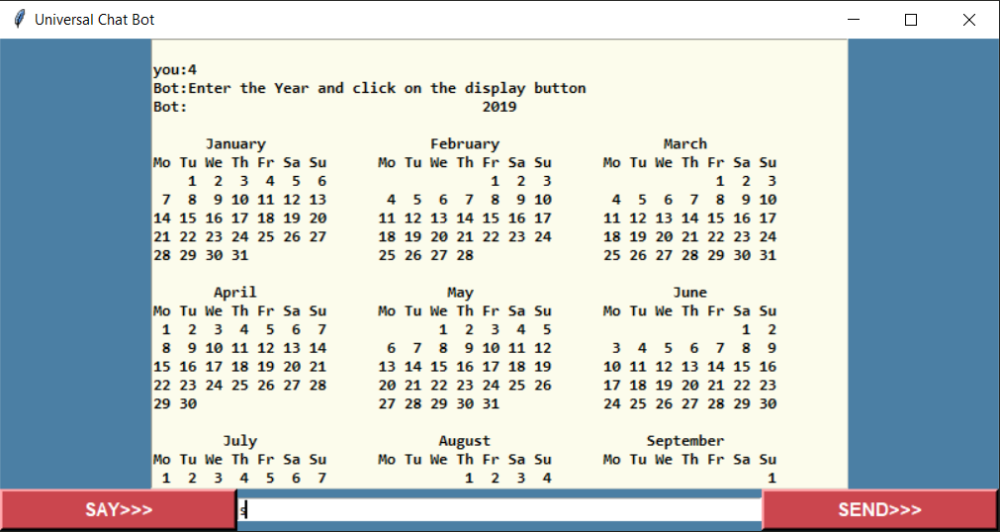

# Chat Bot using Python GUI
Hello, 

This project is on an assistant that can speak and can give you a reply. It also has a microphone which can enable you to communicate freely. I hope you like this Assistant. Thank You !!

📌Features:-

1.Generate Password

2.Get system information

3.To check your internet speed

4.Calender of a given year

5.Download YouTube video

6.Play song/music

7.Google Search(for ex:- book store near me, car shop near me)

8.Open Browser(for ex:- google.com)

### 📌Note :-  This project is under development and can have some errors and problem so please stay tuned for the error, glitches to be fixed. More features will be added to this project. 

# *Output :-*

# *Contact Us :-*

|[Instagram](https://instagram.com/universal_coder)|[Twitter](https://twitter.com/LondheAaryan)|[Linkedin](https://www.linkedin.com/in/aaryan-r-londhe-0a1809179/)|
|-|-|-|
